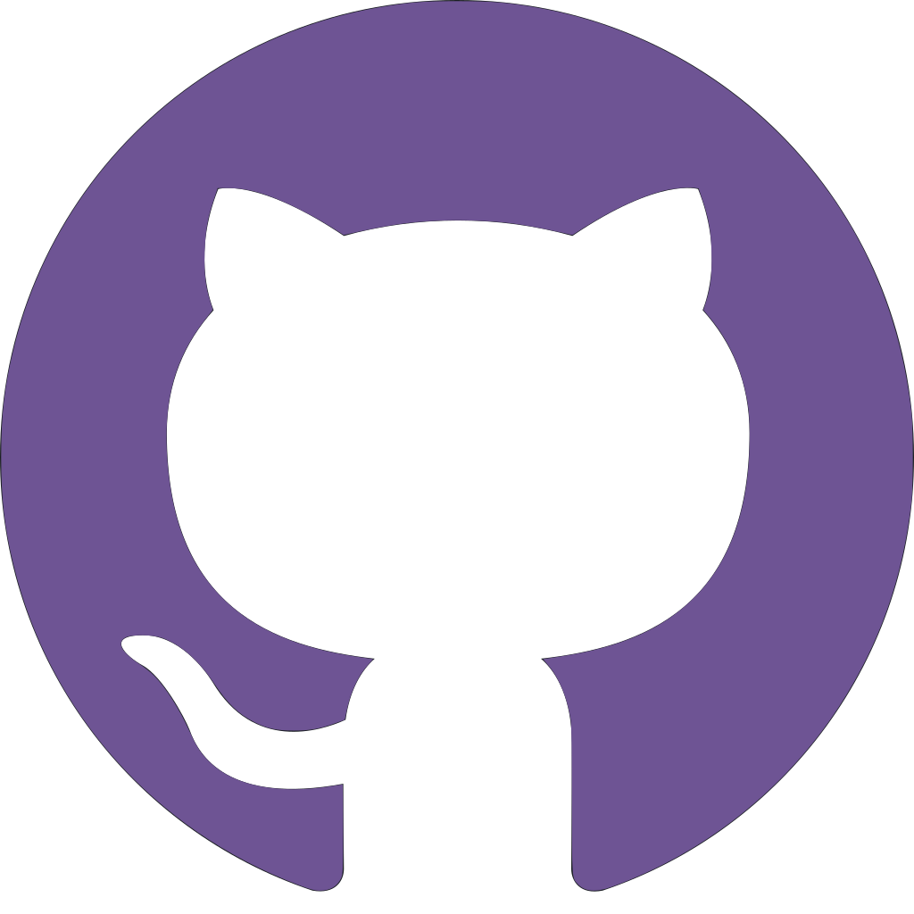

<!---
  Why are you reading my readme's source code? Are you trying to STEAL IT FROM ME??!!
--->

<!---
  You spin me right 'round, baby, right 'round
  Like a record, baby, right 'round, 'round, 'round
  You spin me right 'round, baby, right 'round
  Like a record, baby, right 'round, 'round, 'round
--->
<h2>Hi, I'm Jakub! <a href="https://www.youtube.com/watch?v=PGNiXGX2nLU"></a></h2>


<a href="https://github.com/kubulambula">
  
</a>


<h2>Something about me</h2>


```yaml
# kubulambula.yaml

Kubulambula: 
  Name: Jakub Janšta
  Job: Student # VUT FIT
  Languages:
    - en
    - cs
  Familiar technologies:
    - Godot
    - Python
    - Java
    - C
    - C++
    - 'C#'
    - Git
    - SQL
  Connections:
    Twitter: @kubulambula
    Instagram: @kubulambula
    GitHub: kubulambula
    Email: kubulambula@gmail.com 
```


<h2>Pinned Projects<h2>

<a href="https://github.com/Kubulambula/Godot-GDShell">
  
</a>
<a href="https://github.com/Kubulambula/Godot-CollisionPolygonShape">
  
</a>
<a href="https://github.com/Kubulambula/Untitled-Project">
  
</a>
<br><br>


<h2>Quick connections</h2>

<!---
  The spacing is super dumd, but I could not figure it out any other way
--->
<a href="https://www.instagram.com/kubulambula"></a>

<a href="https://www.twitter.com/kubulambula"></a>

<a href="https://www.github.com/kubulambula"></a>

<a href="mailto:kubulambula%40gmail.com"></a>
<br>
